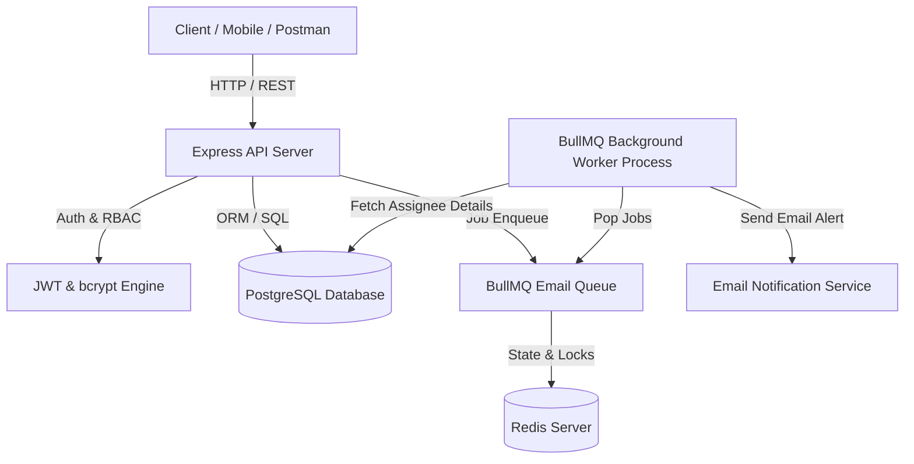

# System Architecture & Technical Design - TaskFlow

## Overview
TaskFlow is a production-ready, lightweight multi-tenant project management system built using **Node.js, Express, TypeScript, PostgreSQL, Prisma ORM, Redis, and BullMQ**.

---

## 🏗️ Architecture & Component Design

### Clean Layering
1. **Routes Layer (`src/routes`)**: Defines REST endpoints, mounts rate limiters, validation schemas, and auth guards.
2. **Controller Layer (`src/controllers`)**: Extracts request parameters, handles HTTP status codes, and delegates domain logic to services.
3. **Service Layer (`src/services`)**: Enforces multi-tenancy rules (`org_id` context), business validation, transactions, and database operations.
4. **Data Access Layer (`src/db/prisma.ts`)**: Prisma ORM client interfacing with PostgreSQL with soft deletes and indexing.
5. **Background Jobs (`src/jobs` & `src/worker.ts`)**: Independent worker process consuming assignment notification tasks from BullMQ/Redis.

---

## 🔒 Multi-Tenant Isolation Strategy
- **Context-Based Authorization**: `org_id` is extracted strictly from the verified JWT access token payload attached to `req.user`.
- **Untrusted Client Inputs**: Client-provided `org_id` parameters in request bodies or query parameters are ignored.
- **Database Indexing**: All tenant-scoped tables (`projects`, `tasks`, `org_members`) feature composite indexes on `org_id` to guarantee fast, scoped queries.
- **Cross-Tenant Prevention**: Attempting to read, update, or delete resources belonging to another organization yields a `403 Forbidden` or `404 Not Found`.

---

## ⚡ Background Processing & Job Queues
- **Queue Engine**: BullMQ backed by Redis.
- **Async Execution**: Task assignment operations enqueue notification jobs asynchronously, returning immediate `200 OK` HTTP responses without waiting for email network calls.
- **Reliability & Retries**: Failed jobs are automatically retried up to 3 times with exponential backoff (`1s -> 2s -> 4s`).
- **Dead-Letter Handling**: Jobs exceeding max retries remain stored in the failed state for inspection.
- **Deduplication**: Job IDs are generated using a 5-second window key (`assignment:taskId:userId:timestampWindow`), preventing duplicate email dispatch during rapid UI clicks.
- **Rate Limiting**: Worker applies a global throttle of 50 emails/minute.

---

## 🗄️ Database Schema & Decisions

### Entity Relationship & Cascades
- **`organizations`** ──(1:N)──> **`projects`** (`ON DELETE CASCADE`)
- **`projects`** ──(1:N)──> **`tasks`** (`ON DELETE CASCADE`)
- **`users`** ──(1:N)──> **`org_members`** (`ON DELETE CASCADE`)
- **`tasks`** ──(1:N)──> **`task_assignments`** (`ON DELETE CASCADE`)
- **`users`** ──(1:N)──> **`task_assignments`** (`ON DELETE RESTRICT` - prevents user deletion while assigned active tasks)
- **`users`** ──(1:N)──> **`comments`** (`ON DELETE RESTRICT` - preserves comment history integrity)

### Soft Delete & Full-Text Search
- **Soft Delete**: `projects` and `tasks` utilize `deleted_at` timestamps. Standard queries filter `deletedAt: null`.
- **Full-Text Search**: Tasks support case-insensitive full-text search across `title` and `description`.
